<div align="center">

# GO-GO

**A one-button wireless GO/PANIC remote for QLab and live shows**
Built on the Heltec WiFi LoRa 32 V3 — WiFi‑OSC, Bluetooth keyboard, or long-range LoRa radio.

[Deutsch](docs/i18n/README.de.md) · [Français](docs/i18n/README.fr.md) · [Español](docs/i18n/README.es.md) · [Русский](docs/i18n/README.ru.md)



*The screens above are pixel-exact renders of the actual firmware UI.*


</div>

<!-- Real photos: drop files into img/ and uncomment
<p align="center">
  
  
</p>
-->

---

## Why

During a show, the sound operator's hands are on the console — not on the laptop. GO-GO puts the two commands that actually matter on a single physical button you can hold, tape to a music stand, or hand to a stage manager:

- **1 click → GO** — advance the cue, play the sound, fire the effect
- **hold 1.4 s → PANIC** — stop everything, now
- **3 fast clicks → menu** on the OLED display

No app, no pairing rituals, no subscription. A €20 dev board and this firmware.

## Operating modes

| Mode | What it does | Use when |
|------|--------------|----------|
| **OSC / WiFi** | Sends OSC over UDP straight to QLab, Ableton Live, or any OSC-capable software | You have solid WiFi and want native QLab control |
| **BLE / HID** | Acts as a Bluetooth keyboard: GO = `Space`, PANIC = `Esc` | Zero-setup — works with anything that takes keystrokes |
| **LoRa TX** | Sends commands by LoRa radio to a paired GO-GO gateway | Big venues, outdoor, or when WiFi can't be trusted |
| **LoRa RX** | Gateway: receives LoRa and forwards as OSC or BLE keystrokes | The receiving end of a LoRa pair |

Two boards make a long-range kit: one remote (TX) + one gateway (RX) next to the computer. Link state, RSSI and battery are always visible on the OLED.

## Quick start — flash a ready-made binary

No Arduino IDE needed, just Python and a USB cable:

```bash
pip install esptool

# find your port
ls /dev/cu.usb*        # macOS — usually /dev/cu.usbserial-XXXX
# Windows: check Device Manager for the COM port

esptool.py \
  --chip esp32s3 \
  --port /dev/cu.usbserial-XXXX \
  --baud 921600 \
  --flash-mode dio --flash-freq 80m --flash-size 8MB \
  write_flash \
  0x0     firmware/bootloader.bin \
  0x8000  firmware/partitions.bin \
  0xe000  firmware/boot_app0.bin \
  0x10000 firmware/go-go.bin
```

The board reboots into GO-GO automatically. On first boot, pick a mode with the button (click = next, hold = confirm).

## Build from source (Arduino IDE)

1. Install the **Heltec ESP32 Dev-Boards** board package
2. Install libraries: `WiFiManager`, `OSCMessage` (CNMAT), `NimBLE-Arduino`, `RadioLib`, `Adafruit SSD1306`, `Adafruit GFX`
3. Select board **Heltec WiFi LoRa 32 V3** and flash `LoRa_soundkorb.ino`

## Setting up

- **OSC mode:** on first run the device opens a WiFi access point `GO-GO-XXXXXX` (password `password123`). Connect and enter your WiFi credentials, target IP, port (QLab: `53000`) and OSC addresses (`/go`, `/panic`).
- **BLE mode:** pair `GO-GO-XXXXXX` as a Bluetooth keyboard. GO types `Space`, PANIC types `Esc` — QLab's defaults.
  > **Note:** BLE mode is keyboard emulation — keystrokes go to the frontmost app. Keep the QLab window focused during the show, or use OSC mode, which doesn't care about focus.
- **LoRa pair:** set one board to LoRa RX, the other to LoRa TX — the remote scans, shows discovered receivers with signal strength, hold to pair. Frequency is **Auto** by default: the gateway picks the cleanest channel in your region and the remote finds it by itself; pick a fixed channel in the menu to disable all automation.
- **Web setup:** menu → *Web Setup* opens a control panel in your browser (the OLED shows the address; in BLE/LoRa modes the device raises its own WiFi network). Everything is there: status, mode, region/frequency, OSC target, BLE keys, a live band spectrum and over-the-air firmware update. In OSC modes the panel is always available at the board's IP.
  > **Spectrum note:** sweeping the band pauses the radio link on that device — the pair reconnects within a second after you stop the sweep. This is normal.
- **Panic hold, menu holds:** every hold action fires while you keep the button pressed — watch the progress bar sweep the hint line.

## Hardware

- **Board:** [Heltec WiFi LoRa 32 V3](https://heltec.org/project/wifi-lora-32-v3/) — ESP32-S3, SX1262 LoRa, 0.96″ SSD1306 OLED
- **Button:** the built-in PRG button (GPIO 0) — no soldering required
- **Optional:** LiPo battery on the board's connector, charge level shown on screen
- **LoRa:** attach the antenna before powering up

## Roadmap

The firmware is a working beta (v15). Planned next — see [docs/ROADMAP.md](docs/ROADMAP.md):

- Region-aware frequency plans (EU868 / US915 / RU864 …) and auto-selection of the cleanest channel
- Remappable BLE keys with presets (QLab / Ableton / presentation)
- Web configuration UI + OTA updates
- Authenticated LoRa packets (shared key)

Issues and PRs welcome.

## License

[MIT](LICENSE) — © Bogdan Korablev, [soundkorb.ru](https://soundkorb.ru)
