# GO-GO — инструкция по эксплуатации (презентация)

Короткая версия [docs/MANUAL.md](MANUAL.md) в формате слайдов: каждый экран
крупно, с комментарием, что на нём происходит и что нажимать. Все скриншоты
ниже — не иллюстрации, а честный рендер тех же функций отрисовки, что и в
самой прошивке (`ui_screens.cpp`), см. [docs/generate_manual_slides.py](generate_manual_slides.py).

---

## Зачем это устройство

Во время показа руки звукооператора — на пульте, а не на ноутбуке. GO-GO
выносит две команды, которые реально решают всё, на одну физическую кнопку:
**клик — GO** (следующий кью), **удержание 1.4 с — PANIC** (стоп всему).
Без приложения, без ритуалов сопряжения — плата за 20€ и эта прошивка.

---

## Слайд 1 — Загрузка

Заставка «soundkorb» — примерно секунда, потом плата сама предлагает
выбрать режим (если он ещё не настроен) или сразу переходит на рабочий
экран сохранённого режима. **Загрузка больше не виснет на подключении к
WiFi** (v16.17): если сеть не отвечает, экран покажет «NO WIFI» за секунды,
а не будет держать чёрный экран, пытаясь достучаться до мёртвой точки
доступа.

## Слайд 2 — Выбор режима

Клик — следующий вариант (OSC/WiFi → BLE → LoRa TX → LoRa RX), удержание —
выбрать. Полоса внизу под подсказкой показывает, сколько ещё держать: это
анимация заполнения шкалы, и она теперь работает **на каждом экране**, где
есть удержание — не только тут.

## Слайд 3 — Рабочий экран (GO)

Один клик отправляет команду GO. Вверху слева — заряд, справа — статус
связи текущего режима (тут «OSC OK» — WiFi подключён и цель настроена).
Кнопка GO всегда видна и всегда одна и та же, независимо от режима.

## Слайд 4 — После GO

Экран подтверждает, что команда реально ушла, и через ~0.7 с возвращается
на рабочий экран. Раньше это окно иногда «не успевало» появиться — причина
была не в этой логике (она работает корректно, проверено трассировкой на
живой плате), а в постороннем шторме переподключений WiFi, который
отъедал процессорное время и мог пропускать короткие перерисовки экрана.
Устранено вместе с переходом на WiFiManager (см. слайд 7).

## Слайд 5 — PANIC

Удержание 1.4 с с рабочего экрана — стоп всему, срабатывает, пока держите
кнопку. Полоса прогресса на рабочем экране показывает время до срабатывания
— так же, как и для GO/PANIC.

## Слайд 6 — Нет связи

Честное сообщение вместо зависания: клик — короткая тихая попытка
переподключиться (без порталов и долгих пауз), удержание — в меню.

## Слайд 7 — WiFi Setup

Меню → WiFi Setup поднимает точку доступа `GO-GO-XXXXXX` (пароль
`password123`) и открывает **WiFiManager** — тот же проверенный флоу, что
был раньше (список сетей → пароль → сохранение), просто перекрашенный под
бренд (тёмная тема, шрифт Unbounded). На той же странице — поля OSC-цели
(IP/порт компьютера с QLab, адреса GO/PANIC): не нужно отдельно заходить в
панель управления после подключения.

> **Только 2.4 ГГц.** У ESP32-S3 в принципе нет радиотракта 5 ГГц — сеть
> площадки на 5 ГГц просто не появится в списке при сканировании. Это
> ограничение чипа, не баг прошивки: нужна именно 2.4-гигагерцовая сеть/SSID
> (у двухдиапазонных роутеров она часто отдельная и не всегда видна по
> умолчанию).

## Слайд 8 — Меню

Три быстрых клика с любого рабочего экрана. `Mode` — смена режима,
`WiFi Setup` — подключение к сети, `Web Setup` — панель управления,
`Status` — вся телеметрия, дальше `Region`/`Freq`/`Spectrum` и клавиши BLE.

## Слайд 9 — LoRa, поиск

Пульт ищет гейтвей по сетке частот региона (режим **Auto** по умолчанию).
Видно, на какой частоте идёт скан; при обнаружении — список станций с
RSSI, удержание — привязка.

## Слайд 10 — LoRa, связь установлена

После привязки — тот же принцип «одна кнопка»: клик GO, удержание PANIC,
только через радио вместо WiFi/BLE. Внизу — RSSI партнёра, полезно для
поиска места с чистым каналом перед показом.

---

## Дальность LoRa

**Честно: мы не проводили собственных замеров дальности на площадке** — ни
одной пары метров, снятой в реальных условиях зала/улицы, в проекте пока
нет (см. `docs/video_script.md`, раздел «Notes on honesty»: не показываем
и не заявляем то, что не измеряли сами).

То, что можно сказать — паспортные цифры чипа **SX1262** при текущих
настройках прошивки (`settings.cpp`: SF7, полоса 125 кГц, кодовая скорость
4/5, мощность — законный максимум региона: 14 дБм EU868/RU864, 22 дБм
US915):

- **Прямая видимость, открытое пространство** — по данным Semtech/Heltec
  для этой связки SF/BW, порядка **2–3 км**. Это паспортное/маркетинговое
  значение производителя чипа, не наш собственный замер.
- **В помещении / через стены площадки** — реалистично **десятки–сотни
  метров**: бетон, металл, толпа людей и прочий 868 МГц-трафик (Zigbee,
  другие LoRa-устройства) режут дальность в разы по сравнению с открытым
  полем. Это тот случай, где паспортное значение почти никогда не
  достигается на практике.

Если возьмёте два комплекта на реальную площадку и замерите дальность (RSSI
на экране `LINK OK` — слайд 10 — как раз для этого) — эти цифры стоит
заменить на настоящие в `docs/MANUAL.md` и здесь.

---

## Быстрый старт (для тех, кто просто открыл коробку)

1. Прикрутить антенну **до** подачи питания.
2. Подключить USB-C или аккумулятор — заставка, затем выбор режима.
3. **QLab по WiFi:** выбрать OSC/WiFi → подключиться к сети площадки через
   WiFi Setup (слайд 7) → указать IP/порт компьютера с QLab на той же
   странице → в QLab включить приём OSC (Workspace Settings → Network) →
   готово, клик = GO.
4. **Без сети вообще:** BLE-режим — сопрячь как Bluetooth-клавиатуру, GO =
   Space, PANIC = Esc, держать окно QLab в фокусе.
5. **Большая площадка / нет WiFi:** LoRa-пара — один пульт (TX), один
   гейтвей (RX) у компьютера, авто-подбор частоты сам находит чистый канал.

Подробности каждого пункта — [docs/MANUAL.md](MANUAL.md),
[docs/osc_setup.md](osc_setup.md), [docs/lora_configuration.md](lora_configuration.md).
