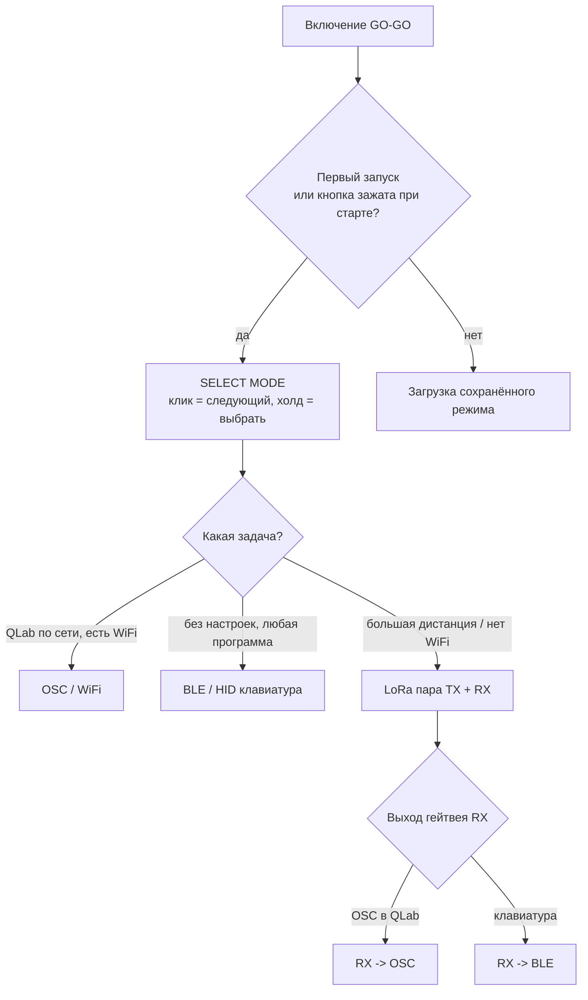

# GO-GO — карта сценариев использования

Пошаговые сценарии для всех вариантов подключения: что делает пользователь, что показывает OLED, какие есть ветки ошибок. По этой карте делаем анимации (см. план внизу) и сверяем UX при рефакторинге.

## Карта выбора режима

---

## Сценарий A — OSC / WiFi (напрямую в QLab)

**Кому:** звукорежиссёр с ноутбуком и нормальным WiFi в зале.

| Шаг | Действие пользователя | OLED | Под капотом |
|-----|----------------------|------|-------------|
| 1 | Включить устройство | boot-анимация `soundkorb` | загрузка Preferences |
| 2 | Выбрать режим OSC/WiFi (клик/холд) | `SELECT MODE` → `OSC / WiFi` | режим сохраняется |
| 3 | Подключиться телефоном к AP `GO-GO-XXXXXX` (пароль `password123`) — страница онбординга открывается сама | `WIFI SETUP` | наш captive portal, см. [scenario E](#сценарий-e--webпанель-и-подключение-к-wifi) |
| 4 | На странице: выбрать свою WiFi-сеть из списка, ввести пароль → «Connected!»; потом в веб-панели указать IP компьютера с QLab, порт `53000`, адреса `/go`, `/panic` | — | конфиг в NVS, `gogo.local` |
| 5 | В QLab: Workspace Settings → Network → разрешить входящий OSC (passcode по желанию) | `OSC OK` + WiFi-бары | UDP-сокет готов |
| 6 | **Клик** | `GO` → `SENT OSC` | UDP `/go` → QLab жмёт GO |
| 7 | **Холд 1.4 с** | `PANIC` → `SENT OSC` | UDP `/panic` → QLab Panic (плавный стоп всего) |

**Ветки ошибок:** нет WiFi → `NO WIFI` (клик = retry + онбординг, холд = меню); неверный пароль сети — страница честно объясняет причину (auth failed / сеть не найдена, возможно 5 ГГц).

---

## Сценарий B — BLE / HID (Bluetooth-клавиатура)

**Кому:** самый быстрый старт; работает с QLab, Ableton, PowerPoint, чем угодно.

| Шаг | Действие пользователя | OLED | Под капотом |
|-----|----------------------|------|-------------|
| 1–2 | Включить, выбрать `BLE / HID` | `SELECT MODE` → `BLE / HID` | WiFi off, NimBLE HID |
| 3 | Mac: Настройки → Bluetooth → подключить `GO-GO-XXXXXX` | `BLE WAIT` → `BLE OK` | HID-клавиатура, advertising |
| 4 | **Клик** | `GO` → `SENT BLE` | keypress `Space` = GO в QLab |
| 5 | **Холд** | `PANIC` → `SENT BLE` | keypress `Esc` = Panic в QLab |

**Ветки:** разрыв BLE → `BLE WAIT`, advertising перезапускается автоматически, но повторное подключение сейчас надо инициировать с компьютера.

> ⚠️ **Это эмуляция клавиатуры:** нажатия уходят в активное (frontmost) приложение. Во время шоу окно QLab должно быть в фокусе. Если фокус может уйти (проектор, второй экран, мессенджеры) — надёжнее сценарий A (OSC), ему фокус не важен.

**Будущее (ROADMAP §2):** переназначение клавиш, пресеты QLab / Ableton / презентации; автоподключение к ранее сопряжённому хосту (bonding + directed advertising).

---

## Сценарий C — LoRa пара: пульт TX + гейтвей RX→BLE

*Анимация LoRa-пары — см. сценарий D ниже (тот же TX/RX-конвейер, отличается только выход гейтвея).*

**Кому:** большие площадки, улица, сцена без доверия к WiFi. Нужно 2 устройства.

**Гейтвей (у компьютера):**

| Шаг | Действие | OLED |
|-----|----------|------|
| 1 | Выбрать `LoRa RX` | `RX OUTPUT: Choose ONE output` |
| 2 | Выбрать `BLE HID` | `WAIT TX` → маячок в эфир каждые 2 с |
| 3 | Подключить как Bluetooth-клавиатуру (сценарий B шаг 3) | `RX BLE OK` |

**Пульт (в руке):**

| Шаг | Действие | OLED |
|-----|----------|------|
| 4 | Выбрать `LoRa TX` | сразу экран `PAIR RX` — поиск |
| 5 | Увидеть найденный RX (ID + RSSI), холд = pair (или холд на пустом списке = ANY) | `1/1 hold pair` → `TX OK xxxxxx` |
| 6 | **Клик** | `GO` → LoRa-пакет → ACK → `SENT LORA`; RX жмёт Space |
| 7 | **Холд** | `PANIC` → `SENT LORA`; RX жмёт Esc |

**Ветки:** нет ACK после 3 ретраев → `NO CONNECTION`; линк пропал (2.8 с без пакетов) → `LINK LOST` (клик = retry); смена частоты/мощности — в меню обоих устройств (должны совпадать!).

---

## Сценарий D — LoRa пара: TX + гейтвей RX→OSC

Как C, но выход гейтвея — OSC: на шаге 2 выбрать `OSC WiFi` — гейтвей коротко пробует сохранённый WiFi, если нет — открывает страницу онбординга (как A шаги 3–4). Дальше идентично C, но RX шлёт UDP `/go`//`/panic` в QLab.

**Особенность:** гейтвею нужны и LoRa-линк, и WiFi одновременно — статус обоих виден на его экране (`RX OSC OK` / `RX LINK WAIT` / `NO WIFI`).

---

## Сценарий E — Web-панель и подключение к WiFi

Два разных экрана под разные задачи:

- **`WiFi Setup`** — только подключение к сети площадки: плата поднимает AP
  `GO-GO-XXXXXX` (пароль `password123`) и открывает **WiFiManager** —
  проверенный, знакомый флоу (список сетей → пароль → сохранение), просто
  перекрашенный в наш стиль (тёмная тема, шрифт Unbounded). На той же
  странице — поля OSC-цели (IP/порт/адреса), заполняются вместе с сетью.
- **`Web Setup`** — полная панель: в BLE/LoRa-режимах через ту же AP, в
  OSC-режимах всегда доступна на `http://gogo.local` (или по IP) в сети
  площадки, без пароля (доверенная сеть площадки). Вкладки:
  Status (телеметрия + кнопки GO/PANIC), Settings (только настройки текущего
  режима), Spectrum (живой радиофон), QLab (транспорт + кью-лист), Firmware
  (обновление из интернета одной кнопкой или вручную).

> ⚠️ Спектрограмма (и на плате, и в вебе) приостанавливает радиолинк на этом
> устройстве: свип постоянно перестраивает приёмник. После остановки пара
> сходится сама за ~секунду. Это ожидаемое поведение, не бага.

## План анимаций по сценариям

Все — тем же конвейером `docs/generate_demo.py` (экраны рендерятся из кода прошивки, фото вшиваются в SVG):

| Файл | Сценарий | Состав кадра | Статус |
|------|----------|--------------|--------|
| `img/gogo-demo.svg` | A (OSC) — хиро в README | плата + мак с QLab-окном | ✅ |
| `img/scenario-ble.svg` | B | плата + мак: системная плашка Bluetooth-пары, затем клавиши Space/Esc подсвечиваются | ✅ (`docs/generate_scenario_demos.py`) |
| `img/scenario-lora.svg` | C/D | две платы (TX в руке / RX у мака), волна между ними, ACK обратно, потом QLab | ✅ (`docs/generate_scenario_demos.py`) |
| `img/scenario-setup.svg` | E — WiFi Setup → Web Panel | план (низкий приоритет) — WiFiManager's real portal is more honest here than a mockup; screenshot/record it instead once the restyle is confirmed on a phone |

Для каждой мини-анимации можно переиспользовать: рендерер экранов, фото платы, палитру QLab — общий код теперь
вынесен в `docs/demo_lib.py` (использует и хиро-анимация, и `docs/generate_scenario_demos.py`), а не продублирован
в каждом скрипте.
